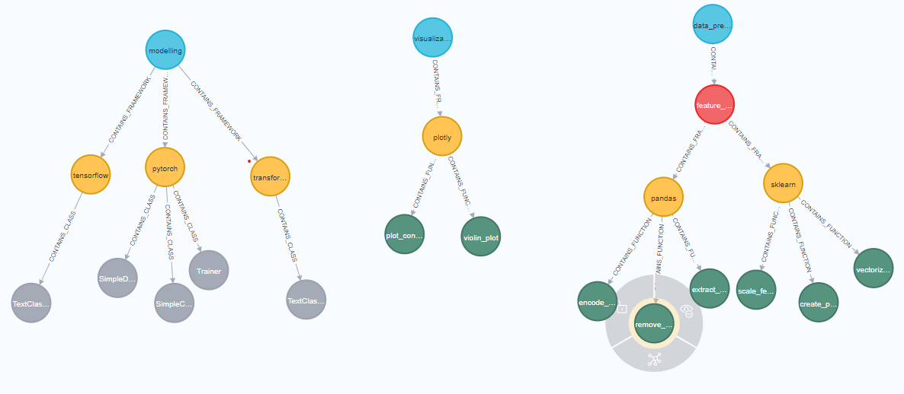
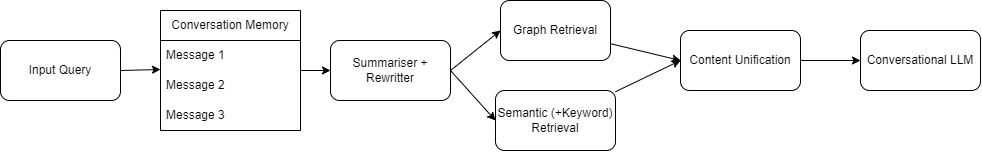

# Chat with your code
<!-- 
 -->


## Project Description

This repository is meant to develop a tool to chat with you own code. Beyond this, the goal is to leverage RAG methods to both help to build a centralized code repository, with reusable and personalized high quality code, and improve regular Chatbots for coding purposes (ChatGPT...) with more customized functionalities. Since the emergence of LLMs, AI development has accelerated significantly. On the other hand, the quality of the code provided by LLMs is often decontextualised, or does not follow our own standards. So, once a 'good implementation' has been retrieved or generated by us, it would be more efective to use it as a starting point for future occasions.

For this implementation we will be using (initially), LangChain, and we will use the development to test its different functionalities, and work on the different key points of these architectures, although those tests will be stored in parallel repositories.

It is important to keep in mind that this is a heuristic development, so it is constantly changing, and anyone can customise the proposed solution. 

To further ilustrate the vision of this project we add to this repository a 'code' folder, over the one we will create a 'Knowledge graph' using 'Neo4j' with this purpose. It spans over a small subset of 'Data Science' areas and frameworks just as a showcase:



We have tried to divide the 'Data Science' field in areas (visualization, modelling, Data Processing...) and then those areas in frameworks relevant to the implementations.

## RAG Implementation

The initial scope of the project was to implement a Knowledge graph from the folder containing our centralised repo, and use a GraphRAG pipeline to retrieve the relevant results. However, after an initial evaluation, this solution alone was not sufficient to get relevant results. Therefore, a Hybrid approach was carried out mixing Graph (Cypher query) retrieval with Semantic (+Keyword) retrieval:




## Installation

Install Python (version 3.10 was used for this development).

Open a terminal in the desired directory and run:

```bash
python3.10 -m venv <your_env_name>
```

Windows:
```bash
./<your_env_name>/Scripts/activate
```

Linux:
```bash
./<your_env_name>/bin/activate
```

Install the dependencies:
```
pip install -r requirements.txt
```


Install the desktop version of [Neo4j](https://neo4j.com/docs/desktop-manual/current/installation/download-installation/).

Once all previous steps are completed, create a .env file with the following variables:

OPENAI_API_KEY=<>

NEO_4J_password=<>


## Usage

Once we have everything set up, the first step would be to generate the knowledge graph from our data, this is completely customizable and is done with a manual/fixed logic, based in personal needs. Also this step will be in continuous improvement. You can find this development, as well as the current logic in [Graph Generation](src\utils\populate_KT_with_code.ipynb). Customize and run those cells to get your own Knowledge graph. This will be automized in next steps.


